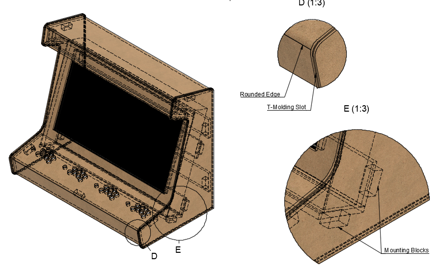
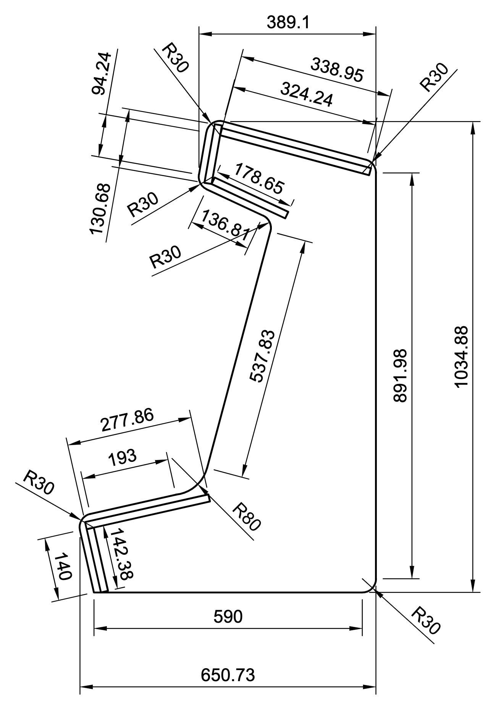

# ArcadeXXL
What do with an unused 46'' TV at the office? Building a full scale Arcade cabinet!

## Specifications
- 1 to 4 players
- All players have 6 buttons and an arcade joystick
- https://a360.co/2VDIrvt

## Cabinet
Sidepanel measurements

## Hardware
- Sony, KDL-46S2000
- Raspberry Pi 3 Model B+
- Stontronics power supply, output +5.1V, 2.5A
- SanDisk microSD Ultra 64GB
- Sanwa Joystick + Push Buttons
