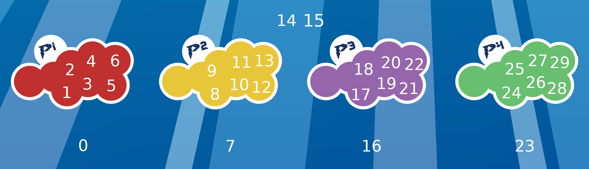

# Controllers
Controller board contains 30 LED-buttons. This section describes the setup and control.

## LEDs
Displaying button/LED numbering:

| Button # | Comment |
| --- | --- |
| 0 - 6 | **Player 1**, Button 0 = Select |
| 7 - 13 | **Player 2**, Button 7 = Select |
| 14 | **Hotkey** |
| 15 | TBD |
| 16 - 22 | **Player 3**, Button 16 = Select |
| 23 - 29 | **Player 4**, Button 23 = Select |

LEDs are driven by an ESP32 controllerboard using [FastLED](https://github.com/FastLED/FastLED) library.

### References
- [FastLED - Pixel reference](https://github.com/FastLED/FastLED/wiki/Pixel-reference)